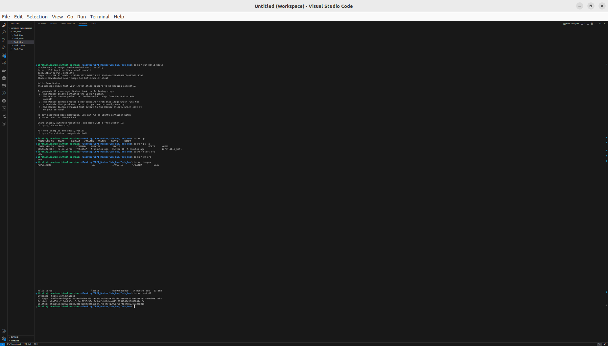

# Task_1

- Run the container hello-world

`docker run hello-world`

- Check the container status

`docker ps -a`

- Start the stopped container

`docker start <container_id>`

- Remove the container

`docker rm <container_id>`

- Remove the image

`docker rmi <image_id>`

