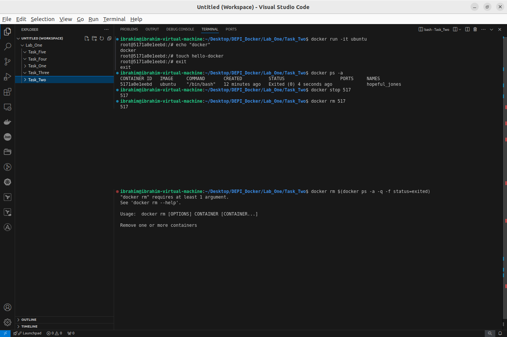

# Task_2

- Run container centos or ubuntu in an interactive mode

`docker run -it ubuntu`

- Run the following command in the container “echo docker ”

`root@5171a0e1eebd:/# echo "docker"`

- Open a bash shell in the container and touch a file named hello-docker

`root@5171a0e1eebd:/# touch hello-docker`

- Stop the container and remove it. Write your comment about the file hello-docker

`root@5171a0e1eebd:/# exit`

`docker ps -a`

`docker stop <container-id>`

`docker rm <container-id>`

<aside>
💡

The file was removed when the container was removed

</aside>

- Remove all stopped containers

`docker rm $(docker ps -a -q -f status=exited)`

