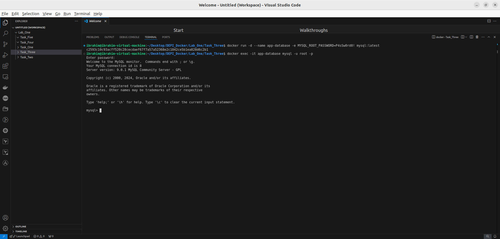

# Task_3

Deploy a MySQL database called app-database. Use the mysql latest image, and use
the -e flag to set MYSQL_ROOT_PASSWORD to P4sSw0rd0!. The container should run in
the background.

`docker run -d --name app-database -e MYSQL_ROOT_PASSWORD=P4sSw0rd0! mysql:latest`   

