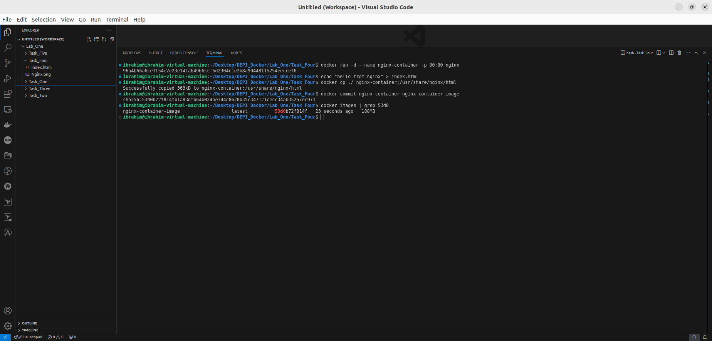
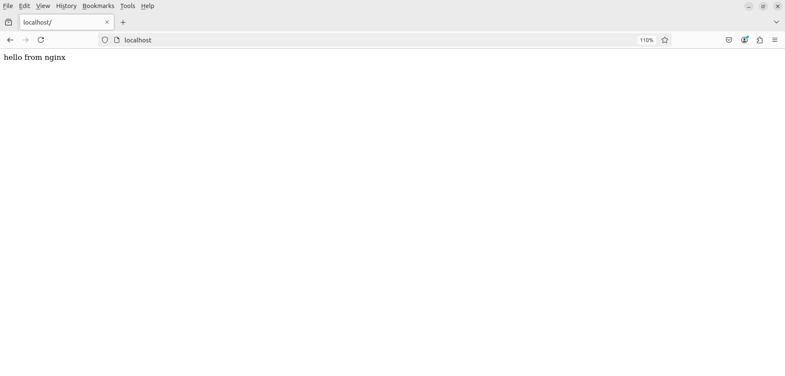

# Task_4

- Run the image Nginx

`docker run -d --name nginx-container -p 80:80 nginx`  

- Add html static files to the container and make sure they are accessible

`echo "hello from nginx" > index.html` 

`docker cp ./ nginx-container:/usr/share/nginx/html`

- Commit the container with image name nginx-container-image

`docker commit nginx-container nginx-container-image` 

