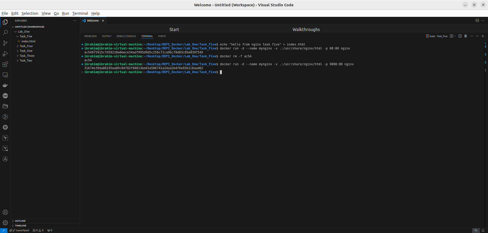
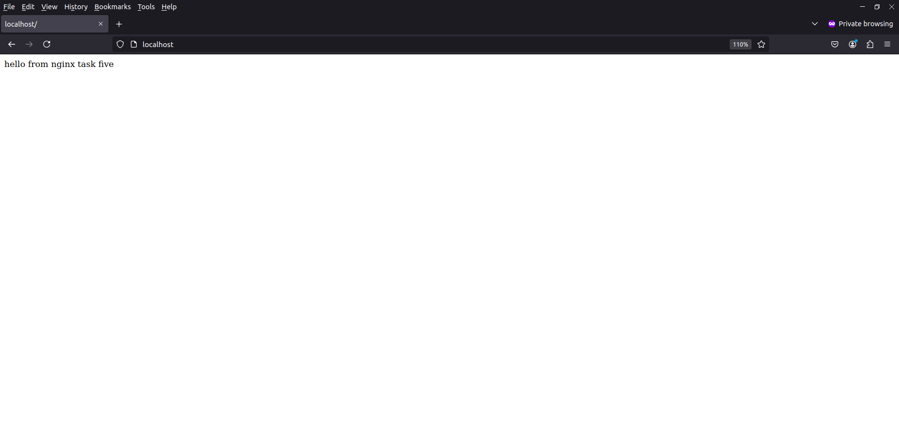

# Task_5

(Bonus) :  

- Run a container Nginx with the name mynginx and attach a volume containing a static HTML file

`docker run -d --name mynginx -p 80:80 -v .:/usr/share/nginx/html nginx`

- Remove the container

`Docker rm -f mynginx`

- Run a new container with the following:

 - Attach the volume that was attached to the previous container and map port 80 to port 9898 on your host machine

`docker run -d --name mynginx -p 9898:80 -v .:/usr/share/nginx/html nginx`

- Access the HTML file from your browser

<aside>
💡

Hit the URL → localhost:9898

</aside>

